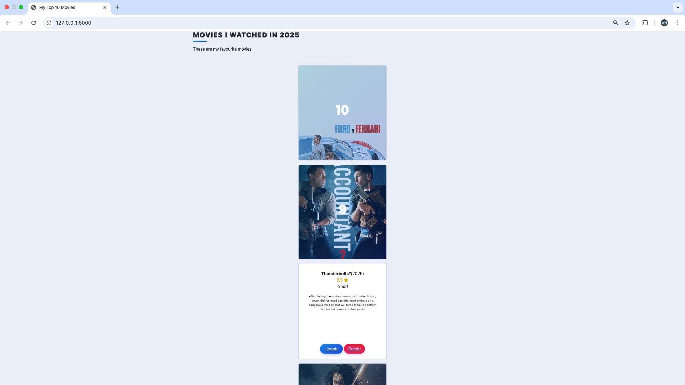

# 🎮 My Movie Collection App

A Flask web application that allows you to search, add, rate, and review movies using [The Movie Database (TMDb)](https://www.themoviedb.org/) API.

---

## 📸 Demo




## 🚀 Features

* 🔎 Search for movies by title using TMDb API
* 🎥 Add movie details including poster, title, year, and description
* ⭐ Rate and review movies
* 📊 Automatically rank movies based on rating
* 🗑️ Delete movies from your list
* 💅 Beautiful Bootstrap-styled UI

---

## 🛠️ Built With

* [Flask](https://flask.palletsprojects.com/)
* [Flask-WTF](https://flask-wtf.readthedocs.io/)
* [Flask-Bootstrap](https://pythonhosted.org/Flask-Bootstrap/)
* [SQLAlchemy](https://www.sqlalchemy.org/)
* [WTForms](https://wtforms.readthedocs.io/)
* [TMDb API](https://developer.themoviedb.org/)
* [Bootstrap 5](https://getbootstrap.com/)


---

## 📦 Installation

### 1. Clone the repository

```bash
git clone https://github.com/ayushi-gajendra/my_top_10_movies_website.git
cd your-repo-name
```

### 2. Create and activate a virtual environment (optional but recommended)

```bash
python -m venv venv
source venv/bin/activate  # On Windows: venv\Scripts\activate
```

### 3. Install dependencies

```bash
pip install -r requirements.txt
```

### 4. Set up the environment variables

Create a file named `.env` in the project root and add:

```env
API_KEY=your_tmdb_api_key_here
SECRET_KEY=your_flask_secret_key_here
```

---

## 🧠 Usage

Run the Flask app:

```bash
python app.py
```

Then open your browser and go to:

```
http://127.0.0.1:5000/
```

---

## 📁 File Structure

```
project/
│
├── app.py
├── .env
├── .gitignore
├── requirements.txt
├── README.md
├── templates/
│   ├── index.html
│   ├── add.html
│   ├── select.html
│   ├── edit.html
│   └── delete.html
└── static/
    └── style.css
```

---

## 🔐 Notes

* Your API key and secret key are securely stored in `.env` (and ignored by Git via `.gitignore`)
* Make sure to follow TMDb’s [terms of service](https://www.themoviedb.org/terms-of-use) when using their API

---

## 📝 License

This project is open-source and available under the MIT License.

---
